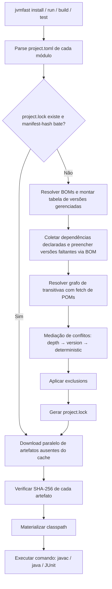

# jvm-fast — arquitetura de um "uv para Java"

**Repositório:** [github.com/nadezhdkov/jvm-fast](https://github.com/nadezhdkov/jvm-fast)

**Nomenclatura:** `jvm-fast` é o nome do projeto (repositório, documentação,
identidade); `jvmfast` (sem hífen) é o nome do binário que o usuário invoca.
A distinção é intencional e mantida em todo o documento — títulos e prosa
referem-se a "jvm-fast", exemplos de comando usam `jvmfast`.

## 1. Objetivo e escopo

> **Nota de leitura (adicionada após as Fases 1–5).** As seções 1–15 são a
> especificação, escrita antes do código. A **seção 16** foi escrita depois,
> confrontando a implementação com POMs reais do Maven Central, e registra
> onde esta especificação é omissa ou incorreta sobre a semântica do
> ecossistema Maven — em particular a efetivação do POM (16.1), a ordenação
> de versões (16.2) e a arquitetura de concorrência da resolução (16.3).
> Onde as duas divergirem, a seção 16 é a mais recente e prevalece.

Ferramenta de linha de comando, binário único nativo, para gerenciamento de dependências,
JDK e execução de projetos Java, priorizando velocidade de resolução e ausência de setup.
Não substitui Maven/Gradle em builds multi-módulo complexos com plugins de empacotamento
avançado — mira o nicho de scripts, projetos single-module e prototipagem rápida, com
caminho de migração para Maven/Gradle quando o projeto crescer.

**Fora de escopo na v1:**
- Build multi-módulo
- Plugins de terceiros (annotation processors customizados, gerador de código)
- Empacotamento avançado (shaded jars, native-image via GraalVM fica em v2)
- Publicação em repositórios (deploy)
- JPMS (`module-info.java`) — v1 assume classpath tradicional (seção 8)

**Dentro do escopo:**
- Resolução e download de dependências
- Gerenciamento de versões de JDK
- Compilação e execução direta (sem POM/Gradle intermediário)
- Testes (integração com JUnit)
- Lockfile determinístico
- Cache global de artefatos
- Suporte a BOMs para gestão centralizada de versões (seção 3.3)
- Exclusions de dependências transitivas (seção 3.4)

**Princípio de núcleo:** a v1 é single-module por escopo, não por limitação
arquitetural. O core nunca assume que um projeto tem exatamente um módulo —
ver seção 3.1 para a abstração `Project`/`Module`/`Workspace` adotada desde
o primeiro commit, mesmo com a CLI expondo só o caso single-module no início.

## 2. Stack de implementação

| Componente | Escolha | Justificativa |
|---|---|---|
| Linguagem do CLI | Rust | Binário nativo, sem GC pausas, startup instantâneo |
| Resolução HTTP | `reqwest` + `tokio` | Downloads paralelos assíncronos |
| Parsing de manifesto | `toml` crate | Formato legível, já usado pelo Cargo/uv |
| Parsing de POM (compat) | `quick-xml` | Ler POMs existentes para import/migração |
| Cache local | Filesystem + SQLite para índice | SQLite evita re-scan de diretório a cada comando |
| Compilação | Invoca `javac` do JDK gerenciado | Não reimplementa o compilador |
| CLI framework | `clap` | Parsing de argumentos, help gerado, completions de shell |
| Import de projetos Gradle | Helper JVM (`jvmfast-gradle-bridge.jar`) usando Gradle Tooling API | Único componente não-Rust da stack; justificado na seção 10 — Tooling API não tem binding Rust maduro |

Alternativa avaliada e descartada: Go. Rust foi preferido por paralelismo mais seguro
(sem races silenciosas) e por ser o que o próprio `uv` usa, o que facilita portar
decisões de arquitetura já validadas.

## 3. Manifesto do projeto — `project.toml`

```toml
[project]
name = "licitare-batch-processor"
version = "0.3.0"
java-version = "21"
source-encoding = "UTF-8"    # encoding de fontes, default UTF-8

[dependencies]
"com.fasterxml.jackson.core:jackson-databind" = "2.17.0"
"org.slf4j:slf4j-api" = "2.0.13"

[dev-dependencies]
"org.junit.jupiter:junit-jupiter" = "5.10.2"
"org.assertj:assertj-core" = "3.25.3"

# BOMs para centralizar versões (seção 3.3)
[boms]
"com.fasterxml.jackson:jackson-bom" = "2.17.0"

# Exclusões de transitivas (seção 3.4)
[exclusions]
"org.apache.httpcomponents:httpclient" = [
    "commons-logging:commons-logging",
]

[repositories]
default = "https://repo1.maven.org/maven2"
# repositórios adicionais, resolvidos em ordem de declaração
internal = "https://nexus.empresa.com/repository/maven-releases"

[run]
main-class = "br.com.licitare.batch.Main"
jvm-args = ["-Xmx512m"]
```

Convenções:
- Chaves de dependência sempre no formato `groupId:artifactId`, nunca separadas em
  subtabelas — evita ambiguidade de parsing e mantém paridade visual com coordenadas Maven
- Versões como string simples (não objeto), com suporte a ranges opcionais (`^2.17.0`,
  `~2.17.0`) resolvidos conforme semântica definida na seção 6.1
- `java-version` aceita major version simples (`"21"`) ou LTS alias (`"lts"`).
  O alias é conveniência de autoria, não de reprodutibilidade: na primeira
  resolução, `"lts"` é gravado em `project.lock` como a versão concreta
  escolhida naquele momento (ex. `"21"`), então builds futuros do mesmo lock
  não mudam de JDK silenciosamente quando uma nova LTS for lançada — só
  `jvmfast update` reavalia o alias
- Quando uma dependência está coberta por um BOM (seção 3.3), o valor da
  chave é `true` em vez de uma versão — sentinela explícita para "gerenciado
  por BOM", distinta de string vazia (seção 3.3)

## 3.1. Abstração interna — Project, Module e Workspace

O core nunca modela o projeto como uma lista plana de dependências. Desde a v1,
a estrutura interna é:

```rust
struct Workspace {
    root: PathBuf,
    modules: Vec<Module>,
    lockfile: Lockfile,
    config: WorkspaceConfig,   // configurações do workspace (seção 3.5)
}

struct Module {
    name: String,
    root: PathBuf,
    declared_dependencies: Vec<Dependency>, // intenção, não estado resolvido
    boms: Vec<BomReference>,               // BOMs declarados (seção 3.3)
    exclusions: HashMap<String, Vec<String>>, // exclusões por coordenada (seção 3.4)
}

struct Dependency {
    coordinate: String,   // "groupId:artifactId"
    version_req: VersionReq,
}

enum VersionReq {
    Explicit(String),     // "2.17.0", "^2.17.0", "~2.17.0"
    BomManaged,           // manifesto declarou `true` (seção 3.3) — resolvido via tabela de BOMs
}

struct BomReference {
    coordinate: String,   // "groupId:artifactId"
    version: String,
}
```

Ponto central: `Module.declared_dependencies` é **declaração**, não resolução.
O módulo nunca guarda quais versões efetivamente vão para o classpath —
essa informação vive exclusivamente no `Lockfile`, no nível do `Workspace`.

Em v1, `Workspace` sempre tem exatamente um `Module` (o diretório raiz do
projeto), e a CLI não expõe o conceito de workspace ao usuário — `project.toml`
não tem seção `[workspace]` nem subdiretórios de módulo. Mas o resolvedor já
opera sobre `Workspace.modules` (uma lista de um item), nunca sobre um único
`Project` monolítico. Isso evita a reestruturação grande do core quando
multi-módulo for implementado (seção 12, Fase 5).

**Regra de ouro que separa declaração de resolução:**

```text
Module          → declara o que precisa (project.toml)
Workspace        → resolve o que será efetivamente usado (project.lock)
```

Essa regra vale mesmo em single-module — o `Module` único do projeto declara,
o `Workspace` (ainda que com um módulo só) resolve. Não existe caminho de
código em que um `Module` resolve suas próprias dependências isoladamente;
isso mantém o resolvedor com uma única responsabilidade e um único ponto de
entrada, independente de quantos módulos existem.

**Grafo interno: topologia separada de estado de resolução.** A resolução
global (seção 6) não pode apagar de qual módulo cada dependência veio — sem
isso, `jvmfast why` (seção 9.1) fica sem informação suficiente para
diagnóstico em workspace com múltiplos módulos. `GraphEdge` e `ResolvedNode`
representam partes diferentes do mesmo grafo e são conectados explicitamente
por `NodeId`, nunca por referência direta entre objetos — isso permite
indexação eficiente e evita acoplar topologia (arestas) a estado de
resolução (nós):

```rust
struct DependencyGraph {
    nodes: HashMap<NodeId, ResolvedNode>,
    edges: Vec<GraphEdge>,
}
```

`GraphEdge` responde "qual dependência levou de um nó a outro" — é pura
topologia, sem estado de resolução:

```rust
struct GraphEdge {
    from: NodeId,
    to: NodeId,
    kind: EdgeKind,
}

enum EdgeKind {
    ModuleDeclared,   // módulo declarou essa dependência diretamente no seu project.toml
    External,         // veio transitivamente de uma dependência externa (Maven Central etc)
    WorkspaceModule,  // o nó de destino é na verdade outro módulo do mesmo workspace
}
```

`ResolvedNode` responde "qual artefato é esse, quais versões foram pedidas e
qual venceu" — é estado de resolução, sem topologia. O nó não guarda só a
versão vencedora: se `commons` é requisitado como `1.8` por `core` e `2.0`
por `api`, o nó preserva os dois pedidos, não só o resultado final:

```rust
struct ResolvedNode {
    id: NodeId,
    coordinate: String,
    requests: Vec<VersionRequest>,  // todas as versões pedidas, não só a vencedora
    selected: String,
    mediation_reason: MediationReason,
}

struct VersionRequest {
    version: String,
    origin_module: String,
    depth: u32,  // usado como critério primário de mediação (seção 6.2)
}

enum MediationReason {
    NearestDepthWins { rejected: Vec<String> },     // critério primário: menor profundidade no grafo
    HigherVersionWins { rejected: Vec<String> },     // tie-break: mesma profundidade, versão maior
    DeterministicTieBreak { rejected: Vec<String> }, // último recurso: mesma profundidade e versão
    SingleRequest,
}
```

A implementação interna do armazenamento de `edges` (adjacency list, matriz,
etc.) fica em aberto; o que é arquiteturalmente obrigatório é: (a) não
descartar a origem de cada aresta durante a resolução, porque não há como
reconstruí-la depois a partir só do lockfile resolvido (seção 4); e (b) nunca
fundir `GraphEdge` e `ResolvedNode` em uma única struct — essa separação é o
que permite o mesmo `DependencyGraph` servir tanto à resolução (que só
precisa de topologia + estado final) quanto ao diagnóstico de `jvmfast why`
(seção 9.1), que percorre `edges` para reconstruir o caminho e consulta
`nodes[id]` para obter o histórico de requests e o motivo da mediação em
cada ponto do caminho.

O `project.lock` (seção 4) precisa persistir tanto `selected` quanto os
`requests` que levaram à decisão — não é um dado só de memória durante a
resolução. Isso é o que permite `jvmfast why` (seção 9.1) reconstruir o grafo
de diagnóstico inteiramente a partir do lockfile, sem re-fetch de metadados
e sem depender de um cache intermediário separado como fonte de verdade.

## 3.2. Autenticação em repositórios privados

Credenciais **nunca ficam em `project.toml` ou `project.lock`** — o
manifesto só declara a URL do repositório (seção 3), nunca `username`,
`password` ou `token`. Isso vale mesmo para repositórios internos como
`nexus.empresa.com`.

Ordem de resolução de credenciais, primeira que encontrar valor vence:

```text
1. Variáveis de ambiente        (JVMFAST_REPO_<NOME>_USERNAME / _PASSWORD)
2. Credential helper / OS credential store   (evolução posterior, não na v1)
3. Arquivo local de credenciais  (~/.config/jvmfast/credentials.toml)
4. Sem credencial (repositório tratado como público)
```

A v1 implementa só os itens 1 e 3 — credential store do sistema operacional
fica para depois.

```toml
# ~/.config/jvmfast/credentials.toml — nunca dentro do workspace, nunca versionado
[repositories.internal]
username = "user"
password = "secret"
```

Este arquivo é tratado como segredo local: permissões restritivas
recomendadas na criação, e o valor nunca aparece em logs, mesmo em modo
verbose. Em CI, a via preferida é variável de ambiente
(`JVMFAST_REPO_INTERNAL_USERNAME`, `JVMFAST_REPO_INTERNAL_PASSWORD`), que tem
precedência sobre o arquivo local.

O `project.lock` pode registrar de qual repositório um artefato veio (campo
`resolved-from`, seção 4) para reprodutibilidade, mas nunca credenciais,
tokens ou headers de autenticação — só o nome do repositório declarado no
manifesto.

**Falha de autenticação é uma categoria de erro própria**, distinta de
artefato inexistente, conflito de resolução ou falha de rede genérica — a
mensagem indica que o repositório exige autenticação, sem nunca ecoar a
credencial fornecida (mesmo quando ela está incorreta).

## 3.3. BOMs — gestão centralizada de versões

No ecossistema Java, BOMs (Bill of Materials) são artefatos POM com
`<dependencyManagement>` que centralizam versões de um conjunto de
bibliotecas relacionadas. São ubíquos — Spring Boot, Jackson, AWS SDK, entre
outros, distribuem BOMs oficiais. Ignorar BOMs tornaria o uso de qualquer
framework maduro desnecessariamente verboso.

```toml
# project.toml — declaração de BOM
[boms]
"com.fasterxml.jackson:jackson-bom" = "2.17.0"
"org.springframework.boot:spring-boot-dependencies" = "3.3.0"

[dependencies]
# `true` em vez de versão — resolvida pelo BOM do Jackson. A chave ainda
# precisa existir (é ela que declara a dependência), então o valor não pode
# simplesmente ser omitido; mas usar `true` como sentinela é mais explícito
# que string vazia ("") — "" poderia ser confundida com um valor ausente por
# engano (typo, geração automática de manifesto), enquanto `true` só faz
# sentido como sinalização intencional de "gerenciado por BOM"
"com.fasterxml.jackson.core:jackson-databind" = true
# versão explícita — sobrepõe o BOM
"org.slf4j:slf4j-api" = "2.0.13"
```

Regras de resolução de BOM:
- BOMs são baixados e parseados como POMs normais, mas só a seção
  `<dependencyManagement>` é relevante — dependências do BOM nunca entram no
  classpath transitivamente por si só
- Quando uma dependência declara versão explícita no manifesto, essa versão
  tem precedência sobre a versão do BOM — BOM é default, não override
- Quando múltiplos BOMs definem a mesma coordenada, a **ordem de declaração
  no manifesto** decide: o primeiro BOM listado vence, análogo ao Maven
- BOMs podem trazer outros BOMs (import transitivo); a profundidade máxima
  de importação transitiva é limitada (default: 10) para evitar loops e
  complexidade de debug
- O lockfile (seção 4) registra a versão efetiva de cada dependência, não o
  BOM de onde veio — o BOM é informação de resolução, não de reprodutibilidade

**Internamente**, BOMs são resolvidos em uma etapa separada, **antes** da
resolução de dependências (seção 6.2): o resolvedor primeiro coleta todos os
BOMs declarados, faz download/cache dos POMs correspondentes, monta uma
tabela `coordenada → versão`, e só então preenche versões faltantes nas
dependências antes de iniciar a resolução do grafo propriamente dita.

## 3.4. Exclusions — remoção de dependências transitivas

Dependências transitivas indesejadas são um problema real e frequente no
ecossistema Java (ex: `commons-logging` trazido por `httpclient` quando o
projeto já usa SLF4J). O manifesto suporta exclusões explícitas:

```toml
[exclusions]
# exclui commons-logging quando trazido transitivamente por httpclient
"org.apache.httpcomponents:httpclient" = [
    "commons-logging:commons-logging",
]
```

Regras:
- Exclusões são aplicadas durante a resolução do grafo (seção 6.2, passo 3),
  antes da mediação — uma dependência excluída nunca entra no grafo como
  candidata
- Exclusões são declarativas e auditáveis — ficam no manifesto, não em flags
  de comando. `jvmfast tree` e `jvmfast why` indicam quando uma dependência
  foi excluída
- Exclusões do tipo "wildcard" (`"org.apache.httpcomponents:httpclient" = ["*"]`
  para excluir todas as transitivas de um artefato) ficam fora da v1 — o caso
  de uso é raro e pode ser adicionado sem mudança de formato, já que `"*"` não
  é uma coordenada Maven válida

## 3.5. Configuração global — `~/.config/jvmfast/config.toml`

Além de credenciais (seção 3.2), o jvm-fast reconhece um arquivo de
configuração global para preferências que não pertencem ao projeto:

```toml
# ~/.config/jvmfast/config.toml

[defaults]
java-version = "21"           # JDK default quando project.toml não especifica
repository = "https://repo1.maven.org/maven2"

[network]
proxy = "http://proxy.corp:8080"   # proxy HTTP/HTTPS para downloads
connect-timeout = 10               # segundos, default 10
max-retries = 3                    # tentativas por request, default 3
concurrent-downloads = 8           # downloads paralelos, default = num_cpus

[output]
color = "auto"                # "auto" | "always" | "never"
progress-bar = true           # barra de progresso para downloads
```

Precedência de configuração (primeira encontrada vence):

```text
1. Flags de CLI          (--no-color, --offline, --jobs N)
2. Variáveis de ambiente (JVMFAST_NO_COLOR, JVMFAST_OFFLINE, etc.)
3. project.toml          (java-version, repositories, etc.)
4. config.toml global    (~/.config/jvmfast/config.toml)
5. Defaults hardcoded
```

## 4. Lockfile — `project.lock`

Gerado automaticamente, não editado manualmente, comitado no controle de versão.

```toml
version = 1
manifest-hash = "sha256:e3f8a1..." # hash agregado de todos os project.toml do workspace (seção 6.2, passo 2)

[[package]]
name = "com.fasterxml.jackson.core:jackson-databind"
version = "2.17.0"
sha256 = "a1b2c3..."
resolved-from = "default"
dependencies = [
    "com.fasterxml.jackson.core:jackson-core@2.17.0",
    "com.fasterxml.jackson.core:jackson-annotations@2.17.0",
]

[[package]]
name = "com.fasterxml.jackson.core:jackson-core"
version = "2.17.0"
sha256 = "d4e5f6..."
resolved-from = "default"
dependencies = []

# entradas de proveniência — só relevantes em workspace com múltiplos módulos;
# em single-module há no máximo um [[request]] por pacote e a mediação é trivial
[[request]]
module = "core"
name = "com.exemplo:commons"
version = "1.8.0"
depth = 1

[[request]]
module = "api"
name = "com.exemplo:commons"
version = "2.0.0"
depth = 2
```

`[[request]]` registra cada versão pedida, por qual módulo e em que
profundidade do grafo — `depth` é o que alimenta a mediação (seção 6.2:
`NearestDepthWins` antes de `HigherVersionWins`), não só um dado informativo.
É isso que permite `jvmfast why` (seção 9.1) reconstruir "quem pediu o quê,
a que distância, e por que o critério de profundidade ou versão decidiu" só
lendo o lockfile, sem re-resolver ou consultar repositório de novo. A regra é:
**tudo que `why` precisa para explicar a resolução tem que estar no lockfile
ou ser inequivocamente derivável dele**; nada de proveniência pode existir
exclusivamente em um cache auxiliar.

Regras:
- Lockfile é a fonte de verdade para builds reproduzíveis; `project.toml` define
  intenção, `project.lock` define exatidão
- `manifest-hash` (topo do arquivo) é o que permite ao passo 2 da resolução
  (seção 6.2) decidir, sem reprocessar nada, se o lock ainda é válido para os
  manifestos atuais do workspace ou se precisa regenerar
- **O lockfile pertence ao `Workspace`, nunca a um `Module` individual** — em v1
  isso é invisível (um módulo só), mas a regra já vale hoje: não existe
  `module.lock`, só `project.lock` na raiz. Quando multi-módulo existir, dois
  módulos do mesmo workspace nunca terão versões resolvidas incompatíveis da
  mesma dependência transitiva sem que isso apareça como conflito explícito
  na resolução (seção 6.2)
- Hash SHA-256 de cada artefato verificado no download e a cada build (proteção
  contra artefato corrompido ou repositório comprometido)
- Regeneração do lockfile só ocorre com comando explícito (`jvmfast update`) ou
  quando `project.toml` muda e o lock fica desatualizado — nunca silenciosamente

## 5. Estrutura de cache global

```text
~/.cache/jvmfast/
├── index.db                    # SQLite: índice de metadados resolvidos
├── artifacts/
│   └── sha256/
│       └── a1/b2/a1b2c3.../    # conteúdo endereçável, 2 níveis de sharding
│           └── jackson-databind-2.17.0.jar
├── jdks/
│   ├── 17.0.10-tem/
│   └── 21.0.2-tem/
├── metadata/
│   └── com.fasterxml.jackson.core/
│       └── jackson-databind/
│           └── versions.json   # cache de versões disponíveis, TTL 24h
├── poms/                       # POMs baixados (para resolução de transitivas e BOMs)
│   └── com.fasterxml.jackson.core/
│       └── jackson-databind/
│           └── 2.17.0.pom
└── resolution/                 # otimização futura, não obrigatória (seção 9.1)
    └── <sha256(project.lock)>/
        └── graph.bin           # grafo pré-construído para acelerar `jvmfast why`
```

Decisões de design:
- Content-addressable storage (path derivado do hash, não do nome) permite que
  múltiplos projetos compartilhem o mesmo artefato fisicamente uma única vez no disco
- Sharding em 2 níveis (`a1/b2/...`) evita diretórios com dezenas de milhares de
  arquivos, problema conhecido de performance em alguns filesystems
- SQLite como índice permite queries de "quais versões estão em cache" sem varrer
  filesystem, mantendo paridade com a filosofia do `uv` de evitar I/O desnecessário
- Metadados de versões disponíveis (resultado de consultar o repositório) têm TTL
  curto para permitir novas releases sem forçar limpeza manual de cache
- POMs são cacheados separadamente para evitar re-download durante resolução de
  transitivas e BOMs — o TTL é permanente (POM publicado nunca muda; se mudar, é
  uma violação do repositório, e `jvmfast update --force` limpa o cache)
- `resolution/<hash>/graph.bin` é puramente uma otimização de velocidade para
  `jvmfast why` (seção 9.1) — a chave é o hash do `project.lock`, então se o
  lock mudar o cache correspondente simplesmente não existe e é reconstruído.
  Nunca é obrigatório: `why` funciona corretamente parseando o `project.lock`
  em memória mesmo sem esse cache existir

> **Ver seção 16.3.** Os diretórios `poms/` e `metadata/` acima estão
> especificados mas **não implementados** — `src/cache/` tem apenas
> `artifacts/` e `index.db`. Sem eles, toda resolução refaz todos os
> round-trips de POM. É o item de maior ganho e menor custo da seção 16.

**Limpeza de cache:** `jvmfast cache clean` remove todo o cache global.
`jvmfast cache clean --artifacts` remove apenas artefatos JAR (mantém JDKs e
metadados). `jvmfast cache info` exibe espaço em disco utilizado por categoria.

## 5.1. Concorrência no cache global

O cache é content-addressable (seção 5) e conteúdo identificado por hash é
imutável — isso já reduz boa parte do risco de concorrência, mas a escrita
em si precisa ser atômica para que dois processos `jvmfast` baixando o mesmo
artefato ao mesmo tempo (dois terminais, CI paralelo) nunca produzam um
arquivo corrompido ou parcialmente escrito sendo lido como válido:

```text
download → arquivo temporário → verifica checksum → rename atômico → path final do cache
```

Um arquivo temporário incompleto nunca é considerado entrada válida do
cache — só existe entrada válida após o rename atômico, que no filesystem é
uma operação indivisível (o segundo processo que tentar a mesma escrita
simplesmente sobrescreve com conteúdo idêntico, sem corrupção, já que o hash
garante que é o mesmo conteúdo).

Para o índice em SQLite (seção 5): leituras concorrentes são permitidas
livremente; escritas contam com as garantias transacionais do próprio
SQLite, sem locking manual adicional sobre o arquivo — implementar um
mecanismo de lock próprio seria complexidade desnecessária, já que o
SQLite já resolve isso.

**O cache nunca é fonte de verdade.** Se o índice ou algum artefato em cache
ficar inconsistente ou corrompido, a resposta é sempre remover e reconstruir
a partir do zero (novo download, nova indexação) — nunca uma tentativa de
reparo em memória do estado inconsistente.

## 6. Algoritmo de resolução de dependências

### Diagrama de fluxo geral



### 6.1. Resolução de version ranges (`^`, `~`)

> **Ver seção 16.2.** Esta subseção assume que versões de repositório são
> semver. Elas não são (`31.1-jre`, `5.3.30.RELEASE`, `1.0`), e a regra de
> pré-release abaixo, aplicada sobre um parser semver, exclui indevidamente
> linhas estáveis como a do Guava.

Antes de qualquer mediação, cada `VersionReq` do manifesto (seção 3) precisa
virar uma lista de versões concretas candidatas. Isso acontece numa etapa
própria, anterior à mediação de conflito:

```text
VersionReq (^2.17.0)
       ↓
consultar versões disponíveis (metadata cache, seção 5)
       ↓
filtrar versões compatíveis com o range
       ↓
candidatos concretos
       ↓
dependency resolution / mediation (seção 6.2 adiante)
       ↓
versão selecionada → project.lock
```

`^` e `~` **não são estratégias de mediação** — eles só definem quais
versões são elegíveis para uma requisição, antes do resolvedor decidir entre
requisições concorrentes de módulos diferentes.

**Caret (`^X.Y.Z`)** — aceita `>= X.Y.Z, < (X+1).0.0` para major `X >= 1`.
Para major zero, a compatibilidade é restrita ao primeiro componente
não-zero, para não tratar uma versão `0.x` como se já fosse estável:

```text
^2.17.0  →  >= 2.17.0, < 3.0.0
^0.17.0  →  >= 0.17.0, < 0.18.0
^0.0.17  →  >= 0.0.17, < 0.0.18
```

**Tilde (`~X.Y.Z`)** — aceita atualizações dentro do mesmo `major.minor`:

```text
~2.17.0  →  >= 2.17.0, < 2.18.0
```

**Pré-releases** nunca são candidatas automaticamente quando o requisito não
pede explicitamente uma pré-release — `^2.17.0` não seleciona `2.18.0-beta.1`
mesmo satisfazendo o range numérico. Uma pré-release só entra na resolução
se declarada explicitamente no manifesto (`version = "2.18.0-beta.1"`).

### 6.2. Fluxo de resolução e mediação de conflitos

A resolução é sempre disparada pelo `Workspace`, nunca por um `Module`
individualmente — em v1, com um módulo só, isso é indistinguível de uma
resolução "por projeto", mas o ponto de entrada do código já é
`Workspace::resolve(&self)`, que itera sobre `self.modules` coletando
declarações antes de montar o grafo. Isso evita, quando multi-módulo existir,
qualquer caminho de código que resolva um módulo isoladamente e produza
estado incompatível com os demais.

Fluxo por comando (`jvmfast install`, `jvmfast run`, `jvmfast build`):

1. **Parse do manifesto** — lê `project.toml` de cada módulo do workspace
   (em v1, só o da raiz), valida sintaxe e coordenadas
2. **Checagem de lockfile** — se existe e está consistente com os manifestos
   (hash agregado de todos os `project.toml` do workspace bate com o
   registrado no lock), pula resolução e vai direto para o passo 6
3. **Resolução de BOMs** — baixa/cacheia POMs dos BOMs declarados, monta
   tabela `coordenada → versão gerenciada`, preenche versões faltantes nas
   dependências declaradas (seção 3.3)
   > **Ver seção 16.1 e 16.4.** O passo 4 abaixo consome o POM como ele vem
   > do repositório; o Maven consome o **POM efetivo** (cadeia de `<parent>`,
   > `${propriedades}` interpoladas, `<dependencyManagement>` aplicado,
   > `<optional>` removido). E expandir todas as versões candidatas antes de
   > mediar, como descrito aqui, deixa no grafo as transitivas de versões
   > que perderam a mediação — o Maven as poda.

4. **Resolução de grafo** — coleta as dependências declaradas de todos os
   módulos do workspace, busca metadados (POM remoto ou cache local) e monta
   um único grafo de transitivas para o workspace inteiro. **Exclusions**
   (seção 3.4) são aplicadas nesta etapa: antes de adicionar uma transitiva
   ao grafo, o resolvedor verifica se ela está excluída para a coordenada-pai
5. **Mediação de conflitos** — quando o mesmo artefato é requisitado em
   versões diferentes, o resolvedor ordena os candidatos por uma chave
   lexicográfica com precedência fixa, nunca critérios concorrentes:

   ```text
   candidate = (depth ASC, version DESC, deterministic_key ASC)
   ```

   Ou seja: **profundidade menor no grafo vence primeiro**; só quando dois
   candidatos empatam em profundidade o critério de **versão maior** é
   avaliado; só quando também empatam em versão entra um desempate
   determinístico (ex. ordem alfabética da coordenada do módulo de origem),
   para garantir que o resultado nunca dependa da ordem em que módulos ou
   metadados foram percorridos durante a resolução. Dependência direta de um
   módulo (`depth = 1`) sempre vence sobre uma transitiva mais profunda,
   mesmo que a transitiva tenha versão numericamente maior — isso evita que
   uma dependência transitiva sobrescreva silenciosamente uma escolha
   explícita de um módulo. O critério que efetivamente decidiu fica registrado
   em `mediation_reason` (seção 3.1): `NearestDepthWins` quando a profundidade
   já resolve, `HigherVersionWins` quando houve empate de profundidade,
   `DeterministicTieBreak` quando nem profundidade nem versão distinguem os
   candidatos
6. **Download paralelo** — artefatos ausentes do cache são baixados
   concorrentemente (pool configurável, default = número de cores)
7. **Verificação de integridade** — SHA-256 de cada artefato baixado
   comparado contra o valor do lockfile (ou do repositório, se lock está
   sendo gerado agora)
8. **Materialização de classpath** — gera lista ordenada de paths para
   `javac`/`java -cp`, sem symlinks (paths diretos para o cache global)

Paralelismo é limitado por repositório (não satura um único host Maven Central
de forma agressiva), mas irrestrito entre repositórios diferentes.

## 7. Gerenciamento de JDK

Inspirado no `sdkman`, mas integrado ao mesmo binário:

```text
jvmfast jdk install 21          # instala Temurin 21 LTS mais recente
jvmfast jdk install 21.0.2-tem  # versão exata
jvmfast jdk list                # lista instaladas + disponíveis
jvmfast jdk use 21              # define default global
```

- Distribuição padrão: Eclipse Temurin (licença permissiva, builds reproduzíveis)
- Resolução de `java-version = "21"` no manifesto usa a JDK do projeto se
  instalada, senão dispara instalação automática com confirmação (a menos que
  `--yes` esteja setado, para uso em CI)
- Cada projeto pode fixar sua própria JDK via `project.toml`, sobrepondo o
  default global — resolvido de forma análoga ao `.python-version` do `uv`/`pyenv`

## 8. Build: compilação e recursos

Layout padrão, sem exigir declaração individual de cada arquivo no
manifesto:

```text
src/
├── main/
│   ├── java/           # compilado por javac
│   └── resources/      # copiado como está
└── test/
    ├── java/
    └── resources/
```

`jvmfast build` compila `src/main/java` com `javac` e copia
`src/main/resources` para `target/classes`, preservando estrutura relativa
(`src/main/resources/application.yaml` → `target/classes/application.yaml`).
`target/classes` é o resultado compilável e executável do módulo — contém
tanto `.class` quanto recursos, sem etapa de merge separada.

`src/test/resources` é análogo, mas só entra no classpath de teste
(`jvmfast test`), nunca no artefato de produção gerado por `build`/`run`.

Configuração avançada de recursos (diretórios alternativos, exclusões,
filtros de processamento) fica fora da v1 — o comportamento padrão acima
cobre o caso comum sem exigir nenhuma seção `[resources]` no manifesto.

**Compilação incremental** não é obrigatória na v1 — `jvmfast build`
recompila `src/main/java` por completo a cada chamada. Isso é aceitável para
projetos pequenos/médios (o nicho da v1), mas o design não assume que
recompilar tudo é permanente: um mecanismo de hash/timestamp por arquivo-fonte
pode ser adicionado depois (`source file → hash → mudou? → recompila só o
que mudou`) sem alterar o contrato de `target/classes` já definido acima. Em
multi-módulo (seção 12, Fase 5), o mesmo princípio se aplica por módulo,
reaproveitando o mecanismo de content-addressable storage já usado para
artefatos baixados (seção 5).

**Annotation processing** — a v1 suporta descoberta automática via
`META-INF/services` (o mecanismo padrão do `javac`, cobre o caso mais
comum: Lombok, MapStruct, Dagger, etc., sem exigir nada no manifesto) e,
além disso, configuração explícita via `[build]`:

```toml
[build]
annotation-processors = ["com.example.MyProcessor"]  # -processor com.example.MyProcessor

[build.processor-args]
key = "value"  # -Akey=value
```

`[build]`/`[build.processor-args]` inteiros são opcionais — sua ausência
significa "só descoberta automática", o comportamento original da v1.
Processor *paths* (`-processorpath`, para um processor que não está no
classpath de compilação normal) e processors que exigem setup especial
continuam fora de escopo.

**JPMS (`module-info.java`) fica fora do escopo inicial**, registrado como
decisão de escopo e não como comportamento indefinido. A v1 assume sempre
classpath tradicional (`javac`/`java` sem `--module-path`); suporte a
`module-path`, `--add-modules`, `--add-reads`, `--add-exports` fica para uma
fase futura não planejada neste documento.

## 8.1. Testes — `jvmfast test`

`jvmfast test` compila `src/test/java`, monta um classpath que inclui
`target/classes` (produção) + `target/test-classes` + dependências de
`[dev-dependencies]`, e executa via **JUnit Platform Console Standalone**.

```text
jvmfast test                           # roda todos os testes
jvmfast test --filter "*.UserTest"     # filtro por classe (glob)
jvmfast test --filter "tag:fast"       # filtro por tag JUnit
jvmfast test --fail-fast               # para no primeiro teste que falhar
```

Detalhes de execução:
- O JUnit Platform Console Standalone JAR é tratado como uma dependência
  interna do jvm-fast, baixada e cacheada automaticamente (não aparece no
  `project.toml` do usuário)
- Relatórios em formato texto (default) e XML JUnit (`--report-xml`,
  compatível com CI/CD que consome resultados de teste)
- `[dev-dependencies]` nunca entram no classpath de `build` ou `run` — são
  exclusivas de `test`
- Exit code distinto para falha de teste vs. falha de compilação vs. erro
  de configuração (seção 11)

## 9. Comandos do CLI

| Comando | Efeito |
|---|---|
| `jvmfast init` | Cria `project.toml` mínimo no diretório atual (seção 9.2) |
| `jvmfast add <coord>` | Adiciona dependência ao manifesto e resolve (seção 9.3) |
| `jvmfast remove <coord>` | Remove dependência e atualiza lock |
| `jvmfast install` | Resolve e baixa conforme lockfile (ou gera um) |
| `jvmfast update [<coord>]` | Regenera lock, respeitando ranges do manifesto |
| `jvmfast build` | Compila para `target/classes` |
| `jvmfast run` | Compila (se necessário) e executa `main-class` |
| `jvmfast test` | Compila e roda testes via JUnit Platform Console (seção 8.1) |
| `jvmfast jdk ...` | Subcomandos de gerenciamento de JDK (seção 7) |
| `jvmfast tree` | Exibe árvore de dependências resolvida |
| `jvmfast why <coord>` | Explica a origem de um artefato no grafo (seção 9.1) |
| `jvmfast cache ...` | Gerenciamento de cache: `clean`, `info` (seção 5) |

Convenção de saída: todo comando tem modo texto legível (default, para humano)
e `--json` (para scripting/CI), seguindo o padrão que ferramentas modernas de
CLI (uv, cargo, gh) adotaram.

**Flags globais** disponíveis em todos os comandos:

> **Ver seção 16.6.** Nenhuma das flags globais desta tabela existe hoje em
> `src/cli/`, nem o subcomando `jvmfast cache`. `--json` e `--offline` não
> são conveniência: o primeiro é a interface de automação que a seção 11
> pressupõe, o segundo sustenta o princípio offline-first da mesma seção.

| Flag | Efeito |
|---|---|
| `--verbose` / `-v` | Aumenta nível de log (pode ser repetido: `-vv`, `-vvv`) |
| `--quiet` / `-q` | Suprime saída não-essencial |
| `--no-color` | Desabilita saída colorida |
| `--json` | Saída estruturada em JSON |
| `--offline` | Falha explicitamente se qualquer acesso à rede for necessário |
| `--yes` / `-y` | Aceita todas as confirmações automaticamente (para CI) |

## 9.1. Diagnóstico de origem — `jvmfast why`

Em single-module, `why` mostra só o caminho até a raiz do grafo. Em
multi-módulo, isso é insuficiente — o mesmo artefato pode entrar no workspace
por caminhos diferentes vindos de módulos diferentes, e a resposta precisa
distinguir três tipos de origem (usando a tipagem de aresta da seção 3.1):

1. dependência declarada diretamente por um módulo;
2. dependência introduzida transitivamente por uma dependência externa desse módulo;
3. dependência introduzida por outro módulo do workspace.

**`why` reconstrói o grafo de diagnóstico em memória a partir do
`project.lock`** (entradas `[[package]]` e `[[request]]`, seção 4) — não faz
re-fetch de metadados do repositório. O lockfile é a fonte de verdade do
estado resolvido; `why` é só uma leitura explicativa desse estado. Se o
lockfile mudar, a próxima chamada de `why` simplesmente reconstrói o grafo a
partir do conteúdo novo, sem risco de exibir um diagnóstico baseado em estado
antigo. O cache opcional `resolution/<hash>/graph.bin` (seção 5) acelera essa
reconstrução quando existe, mas nunca é necessário para `why` funcionar
corretamente.

Exemplo de workspace:

```text
core → jackson-databind → jackson-core
api  → http-client → jackson-core
cli  → api
```

`jvmfast why com.fasterxml.jackson.core:jackson-core` não responde só "veio
de jackson-databind" — isso perde a informação de qual módulo iniciou o
caminho. A saída lista todos os módulos que trazem o artefato, cada um com
seu próprio caminho:

```text
com.fasterxml.jackson.core:jackson-core:2.17.0

core
└── jackson-databind:2.17.0
    └── jackson-core:2.17.0

api
└── http-client:1.4.0
    └── jackson-core:2.17.0
```

Quando o caminho atravessa outro módulo do workspace (não um artefato
externo), isso fica marcado explicitamente como `workspace module` para não
ser confundido com uma coordenada Maven normal:

```text
com.fasterxml.jackson.core:jackson-core:2.17.0

cli
└── workspace module: api
    └── http-client:1.4.0
        └── jackson-core:2.17.0
```

Regra de implementação: o comando nunca "achata" o resultado em um único
caminho — se N módulos trazem o mesmo artefato por N caminhos diferentes,
`why` lista os N, porque a resolução de conflito (seção 6.2) pode ter escolhido
uma versão que não é a que todo mundo esperava, e o ponto do comando é
justamente permitir auditar isso módulo por módulo.

**Quando os caminhos pedem versões diferentes do mesmo artefato**, `why` não
para em listar os caminhos — mostra também o resultado da mediação (seção 6.2)
usando os dados de `ResolvedNode` (seção 3.1), porque a versão vencedora não
deve ficar implícita só no `project.lock`; o usuário não deveria precisar
abrir o lockfile para descobrir qual versão foi escolhida e por quê. O
critério de profundidade tem precedência sobre versão — uma dependência
direta pode vencer uma transitiva de versão maior:

```text
com.exemplo:commons

Requested by:

core
└── commons:1.8
    depth: 1

api
└── library-a
    └── commons:2.0
        depth: 2

Resolution:
  selected: commons:1.8
  reason: nearest dependency wins (depth 1 < depth 2)

  rejected: commons:2.0
    requested by module 'api', via library-a
    reason: greater dependency depth
```

Quando a profundidade empata, o critério seguinte (versão maior) decide, e o
`reason` reflete isso:

```text
Resolution:
  selected: commons:2.0
  reason: same dependency depth (2); higher version selected as tie-breaker

  rejected: commons:1.8
    requested by module 'core', via library-b
```

`why` responde, em uma única execução: quem trouxe a dependência, em que
profundidade, quais versões foram pedidas, qual delas venceu e qual etapa da
precedência (`NearestDepthWins` → `HigherVersionWins` → `DeterministicTieBreak`,
seção 6.2) decidiu isso. O `project.lock` continua sendo o registro
determinístico do resultado; `why` é a camada explicativa sobre esse
resultado, não uma fonte alternativa de verdade.

## 9.2. Inicialização — `jvmfast init`

```text
jvmfast init                    # interativo: pergunta nome e java-version
jvmfast init --name my-app      # não-interativo
jvmfast init --name my-app --java-version 21
```

O comando:
1. Cria `project.toml` mínimo com `[project]` preenchido
2. Cria a estrutura de diretórios `src/main/java/` e `src/test/java/` se não
   existirem
3. Cria um `Main.java` placeholder em `src/main/java/` com um `Hello, World!`
   (a menos que o diretório já contenha arquivos `.java`)
4. Não sobrescreve nenhum arquivo existente — se `project.toml` já existir, o
   comando falha com mensagem indicando que o projeto já foi inicializado
5. Detecta `pom.xml` no diretório e sugere `jvmfast import-pom` ao invés de
   inicializar do zero

## 9.3. Adicionar dependência — `jvmfast add`

```text
jvmfast add com.fasterxml.jackson.core:jackson-databind          # latest release
jvmfast add com.fasterxml.jackson.core:jackson-databind@2.17.0   # versão exata
jvmfast add com.fasterxml.jackson.core:jackson-databind@^2.17.0  # range
jvmfast add --dev org.junit.jupiter:junit-jupiter                # dev-dependency
```

Comportamento:
- Quando a versão é omitida, o resolvedor consulta o repositório e seleciona
  a **latest release estável** (ignora snapshots e pré-releases), registrando
  a versão exata no manifesto
- Adiciona a entrada no `project.toml`, resolve, atualiza `project.lock`, e
  faz download do artefato — tudo em um único comando
- Se a coordenada já existir no manifesto, atualiza a versão (com
  confirmação, a menos que `--yes` esteja setado)
- Validação básica da coordenada antes de consultar o repositório: formato
  `groupId:artifactId`, caracteres válidos

## 10. Migração e interoperabilidade com Maven/Gradle

- `jvmfast import-pom` — lê `pom.xml` existente e gera `project.toml` equivalente,
  reportando quais elementos não têm equivalente (plugins, profiles) e precisam
  de atenção manual. O import preserva:
  - Dependências e suas versões
  - BOMs declarados em `<dependencyManagement>` → seção `[boms]`
  - Exclusões declaradas → seção `[exclusions]`
  - `<properties>` usados para interpolação de versão são resolvidos in-place
  - Repositórios adicionais declarados no POM
  - Version ranges no formato Maven (`[1.0,2.0)`, `[1.5,)`, `(,2.0]`) são
    traduzidos para a sintaxe `^`/`~` do jvm-fast (seção 6.1) quando há
    equivalência direta; ranges sem equivalente simples (limites abertos dos
    dois lados, exclusões pontuais dentro do range) são importados como
    versão fixa (o maior valor satisfazível no momento do import) com aviso
    explícito, já que jvm-fast não implementa a álgebra de intervalos
    completa do Maven
- Projetos podem manter `pom.xml` e `project.toml` lado a lado durante transição;
  `jvmfast` nunca escreve em `pom.xml`
- Classpath gerado é compatível com `-cp` padrão da JVM, então IDEs (IntelliJ,
  VS Code) podem consumir via um plugin fino que lê `project.lock` e expõe como
  módulo, sem precisar entender o formato nativamente desde o dia um

### Migração de projetos Gradle

O jvm-fast não implementa um parser de `build.gradle` / `build.gradle.kts` —
são linguagens de programação completas (Groovy/Kotlin), e parsear
corretamente um build script arbitrário é um problema em aberto que nem o
próprio Gradle resolve sem executar o script. A estratégia de migração
evita parsear o código-fonte do build estaticamente; em vez disso, deixa o
próprio Gradle resolver o build e extrai o resultado já resolvido.

**Mecanismo escolhido: Gradle Tooling API, não init-script + parsing de
stdout.** Uma primeira abordagem cogitada era injetar um script de
inicialização que registra uma task e imprime JSON no `stdout` do processo
`gradlew`. Essa abordagem foi descartada porque o `stdout` de uma invocação
`gradlew` carrega, junto com qualquer `println` da task customizada, todo o
ruído normal do Gradle (progresso, warnings de depreciação, output de outras
tasks na mesma execução) — extrair um JSON confiável dessa mistura exige
heurísticas de delimitação frágeis (marcadores únicos, escaping) que
quebram silenciosamente quando uma nova versão do Gradle muda o que imprime
por padrão. A Tooling API (`org.gradle.tooling`) resolve isso na raiz: ela
não depende do canal de texto do console — devolve modelos tipados através
do próprio protocolo binário do Gradle, com o output de console disponível
separadamente (e descartável) via `setStandardOutput`/`setStandardError` do
`ProjectConnection`.

**Componente novo na stack (seção 2): um helper JVM empacotado com o
jvmfast** (`jvmfast-gradle-bridge.jar`), já que a Tooling API é uma
biblioteca Java — não existe binding Rust nativo maduro para ela. O `jvmfast`
invoca esse helper com a JDK gerenciada (a mesma usada para `javac`, seção
7), então não introduz uma dependência de runtime nova para o usuário além
do que o jvm-fast já gerencia.

O comando `jvmfast import-gradle` executa o seguinte fluxo:

1. Gera um init-script temporário (`jvmfast-model-builder.gradle`) que
   aplica um plugin registrando um `ToolingModelBuilder` customizado — esse
   plugin expõe um modelo tipado (`JvmfastDependencyModel`: lista de
   módulos, cada um com suas dependências resolvidas por configuração,
   coordenada, versão e origem) através da própria Tooling API, em vez de
   imprimir texto
2. `jvmfast-gradle-bridge.jar` abre uma `GradleConnection` para o projeto via
   `GradleConnector.forProjectDirectory(...)`, apontando para o `gradlew`
   (ou distribuição do wrapper) do projeto, com o init-script acima
3. Solicita o modelo customizado via
   `connection.model(JvmfastDependencyModel.class).withArguments("--init-script", path).get()`
   — a Tooling API cuida da compatibilidade entre a versão do Gradle do
   projeto e a versão da Tooling API usada pelo bridge; esse é o motivo
   histórico de a Tooling API existir (IDEs precisam suportar múltiplas
   versões de Gradle com um único cliente)
4. O bridge serializa o modelo tipado recebido para JSON e imprime **só
   isso** no seu próprio stdout (não o do `gradlew`) — o `jvmfast` lê esse
   JSON e gera o `project.toml` correspondente
5. Falhas de build do projeto (erro de configuração, plugin ausente) chegam
   ao bridge como `BuildException`/`GradleConnectionException` tipadas da
   própria Tooling API, não como texto de erro a ser interpretado — o
   `jvmfast` as traduz para uma categoria de erro própria de import, distinta
   de falha de rede ou de resolução (seção 11)

**Por que essa abordagem é superior à alternativa de script + stdout:**
- **Resultado tipado, não texto:** elimina a classe inteira de bugs de
  "Gradle mudou o que imprime e quebrou nosso parser"
- **Compatibilidade de versão é responsabilidade da Tooling API**, não do
  jvm-fast — o bridge funciona contra um range amplo de versões de Gradle
  sem lógica de compatibilidade própria
- **Reaproveita o Gradle Daemon** já rodando no projeto (quando presente),
  o que a chamada direta via `gradlew` em processo separado também faz, mas
  a Tooling API expõe isso de forma mais previsível para chamadas repetidas
- **Erros chegam estruturados**, permitindo distinguir "projeto não
  configurado corretamente" de "plugin incompatível" de "dependência não
  resolvível" sem parsing de mensagem de erro em texto livre

**Custo assumido conscientemente:** essa abordagem é mais difícil de
integrar que a alternativa de script — o jvm-fast deixa de ser "binário Rust
que só invoca `gradlew` como processo externo" e passa a empacotar/versionar
um artefato JVM adicional (o bridge), com seu próprio ciclo de build e
compatibilidade de versão da Tooling API a manter. Esse custo é aceito
porque o resultado é significativamente mais robusto a longo prazo — a
alternativa de script funcionaria no caso feliz, mas cada mudança de
formato de output do Gradle seria um ponto de quebra silenciosa em produção,
exatamente o tipo de fragilidade que este documento evita em outras seções
(ex.: verificação de integridade por hash em vez de confiança implícita,
seção 5.1).

**Divergência de mediação de conflitos, mesmo com dados corretos.** O
modelo extraído reflete a resolução que o Gradle já fez, e o `import-gradle`
grava essas versões exatas no `project.toml`/`project.lock` gerados — então
a primeira instalação após o import é fiel ao que o projeto tinha no
Gradle. Mas o Gradle resolve conflitos por padrão com "maior versão vence"
(highest-version-wins), enquanto o jvm-fast usa "menor profundidade vence"
como critério primário (seção 6.2). Isso significa que um `jvmfast update`
subsequente — que reprocessa o grafo com o algoritmo do jvm-fast em vez de
reusar a resolução importada — pode selecionar versões diferentes das que o
Gradle selecionaria para o mesmo conjunto de dependências declaradas. Vale
documentar isso explicitamente para o usuário no output de `import-gradle`
(algo como "versões importadas do Gradle; `jvmfast update` pode divergir,
veja seção 6.2"), para não ser uma surpresa silenciosa.

Limitações desta abordagem:
- Exige que o projeto tenha um Gradle instalado ou um `gradlew` funcional no
  diretório — a Tooling API ainda precisa de uma distribuição Gradle real
  para se conectar, só evita que o *jvmfast* precise entender a versão
- Plugins de build Gradle muito esotéricos que produzem grafos de
  dependência fora do modelo padrão de configurações (`runtimeClasspath`,
  `compileClasspath`) podem exigir ajustes manuais pós-importação
- Builds multi-projeto exigirão iteração do bridge sobre os subprojetos
  (escopo para a Fase 5)
- O bridge precisa ser mantido compatível com a faixa de versões de Gradle
  que o jvm-fast promete suportar — isso é superfície de manutenção contínua,
  não um custo pago uma única vez na implementação inicial

## 11. Tratamento de erros e diagnósticos

Princípios:
- Erro de resolução de dependência sempre mostra o caminho no grafo até a raiz
  (qual dependência direta trouxe o conflito), nunca só "conflito encontrado"
- Falha de rede distingue explicitamente "repositório indisponível" de
  "artefato não existe" — mensagens diferentes, exit codes diferentes
- Falha de autenticação (seção 3.2) é categoria própria, distinta das duas
  acima — indica que o repositório exige credencial, sem nunca ecoar a
  credencial fornecida
- Nenhuma operação de rede acontece silenciosamente durante `build`/`run` se
  o lockfile já satisfaz todas as dependências (offline-first por padrão,
  flag `--offline` força e falha explicitamente se faltar algo em cache)

**Exit codes:**

| Código | Categoria |
|---|---|
| `0` | Sucesso |
| `1` | Erro genérico / uso incorreto da CLI |
| `2` | Falha de resolução de dependência (conflito, artefato não encontrado) |
| `3` | Falha de rede / repositório indisponível |
| `4` | Falha de autenticação |
| `5` | Falha de compilação (`javac` retornou erro) |
| `6` | Falha de teste (testes falharam, compilação ok) |
| `7` | Falha em runtime (exceção durante `jvmfast run`) |

`--json` (seção 9) continua sendo a interface estruturada preferencial para
automação, com os exit codes como sinalização complementar de shell.

### 11.1. Output e logging

Níveis de verbosidade, do mais silencioso ao mais ruidoso:

| Nível | Flag | O que aparece |
|---|---|---|
| Quiet | `--quiet` | Apenas erros fatais |
| Normal | (default) | Progresso resumido, avisos, resultado final |
| Verbose | `-v` | Decisões de resolução, downloads individuais |
| Debug | `-vv` | Headers HTTP, timings, queries SQLite |
| Trace | `-vvv` | Tudo acima + dumps de estruturas internas |

Convenções visuais:
- **Barra de progresso** durante downloads (desabilitável via `config.toml`
  ou `--quiet`)
- **Cores ANSI** para distinguir erro (vermelho), aviso (amarelo), sucesso
  (verde) — respeitando `NO_COLOR` / `--no-color`
- **Contadores resumidos** após operações batch: `Downloaded 12 artifacts in
  1.3s`, `Compiled 47 files in 0.8s`, `23 tests passed, 0 failed`
- Em modo `--json`, nenhuma saída decorativa — apenas objetos JSON por linha
  (NDJSON), parseáveis por `jq` e similares

## 12. Roadmap por fases

**Fase 1 — resolução e cache**
CLI resolve `project.toml`, gera lock, baixa artefatos, monta classpath.
Sem gerenciamento de JDK ainda (usa `JAVA_HOME` do sistema).
Inclui: BOMs, exclusions, `jvmfast add/remove/install/update/tree/why`.

**Fase 2 — gerenciamento de JDK**
Adiciona `jvmfast jdk *`, integração de `java-version` no manifesto.

**Fase 3 — build e execução**
`compile`, `run`, `test` funcionais, cobrindo o ciclo completo de projeto
single-module: compilação com `javac`, cópia de recursos para
`target/classes` (seção 8), execução via `main-class` do manifesto,
integração com JUnit Platform Console (seção 8.1). Compilação incremental por
arquivo (seção 8) e definição final dos exit codes numéricos (seção 11) são
melhorias desta fase, não bloqueiam o primeiro release funcional dela.

**Fase 4 — interoperabilidade**
`import-pom`, plugin de IDE, documentação de migração.

**Fase 5 — workspace e multi-módulo**
Não é mais exploratória em termos de arquitetura — a abstração `Workspace`/
`Module` já existe desde a Fase 1 (seção 3.1), então esta fase é sobretudo
trabalho de superfície, não de reestruturação de core:
- Expor `[workspace]` e `members = [...]` no `project.toml` raiz
- Permitir múltiplos diretórios com `project.toml` próprio dentro do workspace
- Resolução já é global por construção (seção 6.2); o trabalho aqui é detectar
  e reportar conflitos entre módulos de forma legível (`jvmfast why` precisa
  indicar de qual módulo veio cada dependência no grafo)
- Ordem de compilação por dependência entre módulos (topological sort simples
  sobre o grafo de módulos, não sobre o grafo de dependências externas)
- Build incremental: hash de conteúdo por módulo (reaproveitando o mesmo
  mecanismo de content-addressable storage da seção 5, agora aplicado a
  outputs de compilação, não só a artefatos baixados) para recompilar só
  módulos afetados por uma mudança
- Reavaliar apenas escopo de funcionalidades de build avançadas (publicação
  individual por módulo, paralelização de compilação) — não a arquitetura
  de resolução, que já fica correta desde o início

Continua valendo mantê-la deliberadamente pequena frente ao Gradle: o objetivo
é dependências entre módulos e build incremental básico, não um sistema de
plugins de build.

## 13. Riscos e limitações conhecidas

- Maven Central não expõe um "simple index" tão enxuto quanto PyPI; metadados
  de versão exigem parsing de `maven-metadata.xml`, mais verboso
- Mediação de conflitos de versão em grafos profundos é uma fonte histórica de
  bugs sutis em qualquer resolvedor (Maven, Gradle, Coursier todos tiveram
  casos de regressão aqui) — exige suíte de testes de resolução extensa antes
  de qualquer release estável. A ordem de precedência fixa (seção 6.2:
  profundidade → versão → desempate determinístico) e as entradas
  `[[request]]` com `depth` persistidas no lockfile (seção 4) cobrem o
  diagnóstico completo de `jvmfast why` (seção 9.1) sem ambiguidade entre
  critérios concorrentes. O risco que permanece é de formato: `[[request]]`
  cresce linearmente com o número de conflitos reais do workspace (não com o
  total de dependências), então não deve inflar lockfiles de projetos sem
  conflito — vale confirmar isso com um workspace de referência grande antes
  de fixar o formato como estável. Vale também escrever casos de teste
  explícitos para os exemplos "direta vence transitiva mesmo com versão
  menor" e "empate de profundidade resolve por versão", já que são os pontos
  onde Maven e Gradle historicamente divergem de comportamento entre si
- BOMs com imports transitivos profundos podem criar complexidade inesperada
  de debug — o limite de profundidade de import (seção 3.3, default: 10)
  mitiga o risco, mas vale monitorar com projetos reais (Spring Boot BOM é
  um bom caso de stress test)
- Adoção depende de paridade de funcionalidade com plugins Maven amplamente
  usados (compiler plugin com annotation processing, por exemplo) que hoje
  não estão no escopo — risco real de o nicho ser menor do que parece

### 13.1. Plano de testes de resolução

O resolvedor de dependências é o componente mais crítico e mais suscetível a
regressões. A suíte de testes deve cobrir, como mínimo:

| Categoria | Casos |
|---|---|
| Grafo simples | Dependência direta sem transitivas |
| Transitivas lineares | A → B → C, sem conflito |
| Diamond dependency | A → B, A → C, B → D@1.0, C → D@2.0 |
| Depth wins over version | Direta @1.0 vence transitiva @2.0 |
| Same depth, higher version wins | Duas transitivas com mesma profundidade |
| Deterministic tie-break | Mesma profundidade, mesma versão, módulos diferentes |
| Exclusions | Transitiva excluída não entra no grafo |
| BOMs | Versão gerenciada preenchida, override explícito vence |
| Version ranges (`^`, `~`) | Candidatas filtradas corretamente antes da mediação |
| Pre-release exclusion | `^2.17.0` não seleciona `2.18.0-beta.1` |
| Circular dependency | Detectada e reportada como erro, não loop infinito |
| Repositório indisponível | Fallback correto, mensagem clara, exit code 3 |

Esses testes devem usar **fixtures locais** (POMs sintéticos servidos por um
servidor HTTP mock, sem depender de Maven Central real) para serem rápidos e
determinísticos.

**Complemento obrigatório (seção 16.8):** fixtures locais provam que o
algoritmo faz o que esta especificação diz, mas não que a especificação
corresponde ao Maven — foi exatamente essa a lacuna que deixou 16.1, 16.2 e
16.4 passarem por 228 testes verdes. A suíte precisa de ao menos um caso de
grafo real comparado contra `mvn dependency:list`. À tabela acima somam-se,
como categorias de fixture:

| Categoria | Casos |
|---|---|
| Herança de `<parent>` | Versão e propriedade herdadas do pai, cadeia de 2+ níveis |
| Interpolação | `${prop}` do próprio POM, do pai, e built-ins (`${project.version}`) |
| `dependencyManagement` do POM | Transitiva sem `<version>` preenchida pelo POM que a declara |
| `<optional>` | Optional direta entra; optional transitiva não |
| Ordenação Maven | `1.10 > 1.9`, `33.0.0-jre` não é pré-release, `1.0-alpha < 1.0` |
| Poda | Transitiva exclusiva da versão rejeitada não entra no classpath |
| `type`/`classifier` | Classifier resolve para a URL certa; `type=pom` não vira download de jar |

## 14. Fora do escopo inicial

Decisões de escopo permanentes para a v1, distintas de riscos (seção 13) —
não são incerteza técnica, são corte deliberado:

- **JPMS** (`module-info.java`) — registrado já na seção 8; a v1 assume
  classpath tradicional
- **Self-update do binário** (`jvmfast self update`) — não implementado na
  v1. Todo CLI nativo desse tipo (`uv`, `cargo`) eventualmente precisa disso,
  mas não influencia formato de manifesto, lockfile ou grafo de dependências,
  então pode ser adicionado a qualquer momento sem reabrir decisões já
  fechadas
- **Credential store do sistema operacional** (seção 3.2) — v1 cobre variável
  de ambiente e arquivo local; keychain/credential manager nativo fica para
  depois
- **Build multi-módulo avançado** (publicação individual por módulo,
  paralelização de compilação) — mencionado na Fase 5 (seção 12) como
  reavaliação de escopo, não arquitetura em aberto
- **Gradle import** (`jvmfast import-gradle`) — complexidade significativamente
  maior que POM import: além do parsing (evitado via Gradle Tooling API,
  seção 10), exige empacotar e manter um helper JVM próprio
  (`jvmfast-gradle-bridge.jar`) compatível com uma faixa de versões de
  Gradle — fica para depois do `import-pom` estabilizar
- **Snapshots** (`-SNAPSHOT`) — resolução de snapshots Maven tem semântica
  própria (timestamp-based, `maven-metadata.xml` diferente); v1 trata
  snapshots como artefatos normais sem suporte a unique snapshots.
  **Reclassificado — ver seção 16.7:** desde o Maven 3 o default é unique
  snapshots, então "tratar como artefato normal" resulta em 404 contra
  qualquer repositório com configuração padrão, e o caso de uso corporativo
  que a seção 3 apresenta (`nexus.empresa.com`) é justamente onde
  `-SNAPSHOT` domina. Ou há suporte, ou há rejeição tipada — não silêncio

## 15. Distribuição e instalação

O objetivo central do jvm-fast é ausência de setup (seção 1) — isso vale
também para a instalação do próprio binário, não só para o uso depois de
instalado. Instalar o jvm-fast não pode exigir Rust/Cargo, nem uma JDK
prévia (a JDK é algo que o próprio jvm-fast gerencia, seção 7): a instalação
precisa funcionar como primeiro comando executado numa máquina limpa.

**Fonte de verdade: binários pré-compilados via GitHub Releases.** Todo
outro canal de instalação (script, gerenciadores de pacote) é, na prática,
um redirecionamento para esses artefatos — nunca uma via de build alternativa
com lógica própria, para não duplicar superfície de manutenção.

```text
jvmfast-x86_64-unknown-linux-gnu.tar.gz
jvmfast-aarch64-unknown-linux-gnu.tar.gz
jvmfast-x86_64-apple-darwin.tar.gz
jvmfast-aarch64-apple-darwin.tar.gz
jvmfast-x86_64-pc-windows-msvc.zip
SHA256SUMS                              # checksum de cada artefato acima
SHA256SUMS.sig                          # assinatura (minisign ou cosign), verificável offline
```

Build da matriz de targets acontece em CI a cada tag de release — nunca
manualmente na máquina de um mantenedor, para que o binário publicado seja
sempre reproduzível a partir do commit taggeado.

### 15.1. Via primária — script de instalação

```bash
curl --proto '=https' --tlsv1.2 -LsSf https://jvm-fast.dev/install.sh | sh
```

```powershell
irm https://jvm-fast.dev/install.ps1 | iex
```

O script:
1. Detecta OS e arquitetura (`uname -sm` / equivalente Windows)
2. Resolve a versão mais recente publicada (ou respeita `JVMFAST_VERSION` se
   setada, para instalar uma versão específica/fixar em CI)
3. Baixa o artefato correspondente do GitHub Release e o `SHA256SUMS`
   correspondente, verifica o checksum antes de qualquer extração
4. Extrai o binário para `~/.local/bin` (ou `%LOCALAPPDATA%\jvmfast\bin` no
   Windows), sem exigir privilégio de root/administrador
5. Verifica se o diretório de destino está no `PATH`; se não estiver, avisa
   e sugere a linha exata a adicionar ao shell profile (nunca edita
   `.bashrc`/`.zshrc` do usuário automaticamente — mutar dotfiles sem
   confirmação explícita é o tipo de ação que este documento trata como
   arriscada em outras frentes, ex. seção 3.2 nunca gravar credencial sem
   intenção clara do usuário)

**Falha de checksum aborta a instalação e não deixa binário nenhum no
destino** — o mesmo princípio de "nunca considerar válido um artefato
parcial ou não verificado" já usado no cache de dependências (seção 5.1)
se aplica aqui.

**Sobre a confiança em `curl | sh`:** é um ponto legítimo de desconfiança
(executar código de rede direto no shell, sem revisão prévia do que será
rodado). Mitigação adotada: o script-fonte é público e auditável no mesmo
repositório do jvm-fast (não hospedado só como endpoint opaco), a flag
`--proto '=https' --tlsv1.2` no exemplo evita downgrade de protocolo, e a
via manual (seção 15.3) sempre existe como alternativa para quem prefere
não confiar no pipe.

### 15.2. Vias secundárias — gerenciadores de pacote

Mantidas como conveniência para quem já procura instalar ferramentas de CLI
por esses canais, mas nenhuma é obrigatória para usar o jvm-fast:

| Canal | Comando | Observação |
|---|---|---|
| Homebrew (macOS/Linux) | `brew install jvmfast` | Fórmula aponta para o binário do GitHub Release, não builda do zero |
| Scoop (Windows) | `scoop install jvmfast` | Manifest análogo à fórmula do Homebrew |
| Cargo (quem já tem Rust) | `cargo install jvmfast` | Único canal que builda a partir do source; mais lento, mas útil para quem já tem a toolchain e quer a versão mais recente sem esperar o binário pré-compilado |
| Docker | `docker run ghcr.io/.../jvmfast` | Útil para CI que já roda tudo em container; não é a via recomendada para uso local do dia a dia |

`cargo install` nunca é apresentado como via primária na documentação — ela
exige Rust instalado, o que contradiz diretamente o objetivo de "sem setup"
do projeto (seção 1). É a via natural para contribuidores do próprio
jvm-fast, não para o usuário final Java.

### 15.3. Via manual — sem script

Sempre documentada, mesmo sendo mais verbosa, como caminho para quem não
quer rodar o script de instalação:

```text
1. Baixar o artefato certo para a plataforma em
   github.com/nadezhdkov/jvm-fast/releases/latest
2. Baixar SHA256SUMS do mesmo release
3. Verificar: sha256sum -c SHA256SUMS --ignore-missing
4. Extrair e mover o binário para um diretório no PATH
```

### 15.4. Versionamento e canais de release

- **SemVer** para o binário (`jvmfast --version`), independente do
  `version = 1` do formato do lockfile (seção 4) — mudar o formato do lock é
  uma decisão à parte de lançar uma nova versão do binário, e os dois nunca
  devem ficar acoplados implicitamente
- Só um canal estável na v1 — sem canal `nightly`/`beta` público. Builds de
  desenvolvimento ficam restritas a artifacts de CI por PR, não a um canal
  de distribuição versionado; um canal de pré-release fica para quando
  houver base de usuários grande o suficiente para justificar o overhead de
  manter dois canais (mesmo raciocínio de "cortar escopo deliberadamente"
  já usado na seção 14)
- `jvmfast self update` fica fora da v1 (seção 14) — instalação inicial via
  script/gerenciador de pacote é resolvida por esta seção; atualização é um
  problema relacionado mas deliberadamente adiado

## 16. Lacunas de correção e viabilidade (revisão pós-implementação)

As seções 1–15 foram escritas **antes** do código, como especificação. Esta
seção foi escrita **depois** das Fases 1–5, lendo a implementação contra POMs
reais do Maven Central. Ela não é uma lista de escopo cortado — isso é a
seção 14, e continua válida. É a lista de pontos onde a especificação é
**omissa ou incorreta** sobre a semântica real do ecossistema Maven, e onde
a implementação atual, em consequência, produz resultado **errado ou
ausente**, não apenas reduzido.

A distinção importa porque a seção 14 descreve decisões que podem ser
mantidas indefinidamente sem prejuízo, enquanto esta seção descreve o que
separa o projeto de ser utilizável em um projeto Java real.

### 16.1. Efetivação do POM (`EffectivePom`) — o bloqueador principal

O Maven nunca resolve um `pom.xml` como ele está escrito no repositório. O
que alimenta a resolução é o **POM efetivo**: o POM bruto acrescido da
cadeia de `<parent>` (recursiva), com `${propriedades}` interpoladas, com
`<dependencyManagement>` (próprio, herdado e importado) aplicado às
dependências que omitem `<version>`, e com `<optional>true</optional>`
removido do conjunto transitivo.

A implementação atual consome o POM **bruto**: `pom::parse_pom_xml` declara
explicitamente que não interpola `${...}` e não segue `<parent>`, e
`graph::build_graph` empurra `PomDependency.version` direto para a fila do
BFS. As `managed_dependencies` são parseadas mas só consultadas para BOMs
declarados no manifesto do usuário — nunca para o `<dependencyManagement>`
do próprio POM sendo expandido.

O efeito não é degradação; é falha. Dois exemplos verificados contra o
Maven Central real:

```text
com.fasterxml.jackson.core:jackson-databind:2.17.0
  → <parent> jackson-base
  → dependência: jackson-core,        <version>${jackson.version.core}</version>
  → dependência: jackson-annotations, <version>${jackson.version.annotations}</version>
     (ambas as propriedades definidas no POM pai, não neste)

com.google.guava:guava:33.0.0-jre
  → <parent> guava-parent
  → dependências jsr305, checker-qual, error_prone_annotations,
    j2objc-annotations: sem <version> nenhuma (geridas pelo
    <dependencyManagement> do pai)
```

No primeiro caso o resolvedor tenta buscar
`.../jackson-annotations/${jackson.version.annotations}/jackson-annotations-${jackson.version.annotations}.pom`
e recebe 404, que vira `GraphError::Fetch`. No segundo, a versão chega como
string vazia e a URL formada é igualmente inexistente. Vale registrar que
`jackson-databind` é **o exemplo usado na seção 3 deste próprio documento**
— a dependência que o manifesto de referência declara não resolve na
implementação atual.

**Arquitetura exigida:** um estágio novo entre "buscar POM" e "virar
candidato do grafo", com tipo próprio:

```text
ParsedPom (bruto, o que veio do repositório)
      ↓  resolver cadeia de <parent> (recursiva, profundidade limitada)
      ↓  mesclar <properties>: filho sobrepõe pai; mais as built-in
      ↓     (${project.version}, ${project.groupId}, ${project.artifactId})
      ↓  interpolar ${...} em version/groupId/artifactId/scope
      ↓  mesclar <dependencyManagement> (próprio + herdado + importado)
      ↓     e preencher versões omitidas
      ↓  descartar <optional>true</optional> do conjunto transitivo
EffectivePom (o que a resolução pode consumir)
```

Regras que essa etapa precisa respeitar:

- `ParsedPom` e `EffectivePom` são **tipos distintos**, e `build_graph`
  aceita apenas o segundo. É a mesma disciplina que a seção 3.1 aplica a
  `Module` (declaração) versus `Workspace` (resolução): um POM bruto nunca
  deve conseguir chegar ao resolvedor, e o sistema de tipos é o que garante
  isso — não uma convenção de chamada.
- A profundidade da cadeia de `<parent>` é limitada, pelo mesmo motivo e com
  o mesmo default (10) já adotado para import transitivo de BOM na seção 3.3.
- Um `${...}` que sobra depois da interpolação é **erro tipado**, nunca uma
  tentativa de fetch com o literal — buscar uma URL contendo `${` é uma
  falha de rede disfarçada de falha de resolução, exatamente a confusão de
  categorias que a seção 11 proíbe.
- `<optional>` precisa ser lido pelo parser (hoje `text_target` reconhece
  apenas `groupId`/`artifactId`/`version`/`type`/`scope`). Uma dependência
  optional declarada **diretamente** por um módulo continua valendo; o que
  não propaga é o caso transitivo — mesma assimetria que a seção 6.2 já
  aplica a `provided`/`test` via `propagates_transitively`.
- POMs efetivos são cacheáveis por `coordenada@versão` com TTL permanente,
  pela mesma razão que a seção 5 dá para POMs brutos (um POM publicado não
  muda).

### 16.2. Modelo de versão — versões Maven não são semver

`version::SemVer::parse` exige exatamente três componentes numéricos e trata
tudo após o primeiro `-` como pré-release. O ecossistema Maven não segue
semver, e os contraexemplos não são exóticos:

| Versão real | O que acontece hoje |
|---|---|
| `33.0.0-jre`, `31.1-jre` (Guava) | `-jre` é lido como pré-release; `31.1` nem sequer parseia (dois componentes) |
| `5.3.30.RELEASE` (Spring legado) | quatro componentes, não parseia |
| `1.0`, `2.5` (comuns em libs antigas) | dois componentes, não parseia |
| `9999.0-empty-to-avoid-conflict-with-guava` | dependência real declarada pelo Guava; lida como pré-release |
| `21.0.5+11` (builds de JDK) | metadado `+` não modelado |

As consequências são três, e a primeira é a mais grave:

1. **Mediação silenciosamente errada.** `mediation::compare_versions` cai em
   `str::cmp` quando qualquer um dos lados não parseia. Em comparação
   lexicográfica, `"10.0" < "9.0"` e `"1.10" < "1.9"`. O critério
   "versão maior vence" da seção 6.2 então seleciona a versão *menor*, de
   forma determinística e sem aviso. Um resultado errado determinístico é
   pior aqui que um erro tipado: ele é reproduzível, então parece correto.
2. **Ranges inutilizáveis em bibliotecas reais.** `graph::resolve_version_range`
   filtra as versões publicadas por `SemVer::parse().ok()`; para o Guava,
   isso descarta a linha de releases inteira e o range falha com
   `UnresolvedVersionRange`.
3. **Regra de pré-release aplicada onde não cabe.** A seção 6.1 determina,
   corretamente, que pré-releases não entram automaticamente. Mas `-jre` e
   `-android` no Guava são qualificadores de **plataforma-alvo**, não de
   estabilidade — a regra da seção 6.1, implementada sobre um parser semver,
   exclui automaticamente a linha estável mais usada do ecossistema.

**Correção exigida:** implementar a ordenação de versões do próprio Maven
(`ComparableVersion`): segmentação por `.`, `-` e transições dígito↔letra;
segmentos numéricos comparados numericamente e com zeros à esquerda
irrelevantes; segmentos qualificadores com ordem conhecida
(`alpha` < `beta` < `milestone` < `rc`/`cr` < `snapshot` < `""` (release)
< `sp`), e qualificadores desconhecidos ordenados depois de `""`,
lexicograficamente entre si.

Duas regras de fronteira decorrem disso:

- `SemVer` permanece útil **apenas** para interpretar a sintaxe de autoria
  `^`/`~` do `project.toml` (seção 6.1), que é uma escolha do jvm-fast. Ele
  nunca deve ordenar versões vindas de um repositório.
- Nenhum caminho de ordenação pode ter fallback para `str::cmp`. Se uma
  versão não é ordenável, isso é um erro tipado — não um palpite estável.

### 16.3. A resolução é sequencial e sem cache — a inversão de performance

Este é o ponto onde a premissa do projeto e a implementação se contradizem
diretamente.

`pom::HttpPomProvider` usa `reqwest::blocking` e `graph::build_graph` busca
um POM por vez, dentro do laço do BFS. O comentário de módulo em
`http.rs` justifica isso com "sem concorrência real a ganhar" — a
afirmação está invertida. E a seção 5 deste documento especifica dois
diretórios de cache que **não existem** em `src/cache/` (que tem apenas
`artifacts/` e `index.db`):

```text
poms/       # TTL permanente     — especificado na seção 5, não implementado
metadata/   # TTL 24h            — especificado na seção 5, não implementado
```

A combinação significa que **toda** resolução refaz **todos** os
round-trips de POM, em série, mesmo para coordenadas que não mudaram.

O que está paralelizado (`download::DownloadClient`, com `tokio`, semáforo
global e por host) é o download de JARs — justamente a parte que o cache
content-addressable já torna barata: numa execução morna, nenhum JAR é
baixado. O que roda em série é a busca de metadados — justamente a parte
que acontece em toda resolução fria e que domina o tempo de parede. A
paralelização foi aplicada à metade errada do problema.

A ordem de grandeza importa para a tese do projeto. O grafo de um
`spring-boot-starter-web` tem algumas centenas de POMs; a 50–80 ms de RTT
cada, em série, isso é dezenas de segundos, contra o segundo aproximado que
Maven ou Gradle levam com repositório local morno. Na métrica que dá nome
ao projeto, o jvm-fast seria hoje **mais lento** que a ferramenta que
pretende substituir.

**Correção exigida**, nesta ordem:

1. Implementar `poms/` e `metadata/` como a seção 5 já especifica. É o
   ganho maior e o mais barato: o segundo `install` deixa de tocar a rede.
2. Tornar a construção do grafo **paralela por nível**: o BFS já processa
   por profundidade, então todos os POMs de profundidade *N* podem ser
   buscados concorrentemente antes de expandir o nível *N+1*, reusando a
   mesma disciplina de cliente e semáforo por host de `download`. O
   determinismo é preservado porque a mediação (seção 6.2) é função pura do
   conjunto de `VersionRequest` coletados, não da ordem de chegada deles —
   mas isso passa a ser uma invariante que precisa de teste explícito, e não
   apenas uma propriedade acidental do percurso serial.

Vale nomear o motivo de fundo: a velocidade do `uv`, que este documento toma
como referência desde o título, vem de **paralelismo de metadados**, não de
paralelismo de download. Sem o item 2 acima, a comparação com o `uv` não se
sustenta.

### 16.4. Poda do grafo — transitivas de versões perdedoras entram no classpath

`build_graph` controla expansão com um conjunto `expanded` chaveado por
`(coordenada, versão)`. Quando a mesma coordenada é pedida em duas versões,
**as duas são expandidas**, e as transitivas de ambas viram candidatas,
arestas do grafo e — depois da mediação, que só decide a versão da
coordenada em conflito, não o destino das subárvores — entradas do
lockfile e do classpath.

O Maven poda: quando uma versão perde a mediação, a subárvore que ela
trouxe deixa de fazer parte da resolução. Um artefato que só existia no
grafo porque a versão rejeitada dependia dele não deve estar no classpath.

O efeito prático é um classpath com artefatos que nada na resolução final
referencia, um `project.lock` que os registra como se fossem necessários, e
um `jvmfast tree` que os exibe. É uma divergência de resultado em relação ao
Maven, não uma diferença de desempenho.

**Correção exigida:** a resolução precisa ser iterativa em vez de um passe
único "expandir tudo, mediar no fim". A forma mais direta, preservando a
precedência da seção 6.2: expandir um nível, mediar as coordenadas
conhecidas, podar as subárvores das versões rejeitadas, e só então expandir
o nível seguinte. Isso muda a fronteira entre `graph` e `mediation` —
`mediate` deixa de ser uma etapa posterior a `build_graph` e passa a ser
chamada por ele a cada nível — o que é uma mudança de organização de código,
não de modelo de dados: `CandidateNode`, `GraphEdge` e `ResolvedNode`
continuam exatamente como a seção 3.1 os define.

Observação de ordem: este item vem **antes** do 16.3. Paralelizar a
construção de um grafo que ainda produz o conjunto errado apenas chega mais
rápido à resposta errada.

### 16.5. Identidade de artefato — coordenada não é `groupId:artifactId`

Todo o sistema — `Dependency.coordinate`, a chave de `coordinate_ids` no
grafo, `maven::artifact_path`, as chaves do `project.lock` — assume que
`groupId:artifactId` identifica um artefato. No Maven, a identidade é
`groupId:artifactId:type:classifier`.

Casos reais que isso não cobre:

- `io.netty:netty-transport-native-epoll` com classifier `linux-x86_64` — o
  artefato sem classifier existe, mas é um jar praticamente vazio; o binário
  nativo está sob o classifier.
- Dependências com `<type>pom</type>` fora de um contexto de import de BOM —
  não existe `.jar` publicado, e a tentativa de baixar um produz 404.
- `<type>test-jar</type>` e classifiers `tests`/`sources`.

Hoje `<classifier>` sequer é lido pelo parser, e `artifact_path` não tem
onde encaixá-lo: a URL formada aponta para o artefato sem classifier, então
o resultado é 404 ou — pior — o jar errado, baixado e verificado com
sucesso contra o checksum do jar errado.

**Correção exigida:** alargar o tipo de coordenada para carregar `type`
(default `jar`) e `classifier` (default ausente), propagando isso até o
layout de repositório e as chaves do lockfile.

Isso **muda o formato do `project.lock`**, e é por isso que aparece aqui e
não numa lista de melhorias futuras: quanto mais tempo o formato atual
existir em repositórios de usuários, mais caro fica. A seção 15.4 já
desacopla a versão do formato de lock da versão do binário exatamente para
permitir esse tipo de mudança — é o momento de usar esse desacoplamento,
antes de haver base instalada.

### 16.6. Superfície de CLI documentada e ausente

A seção 9 especifica flags globais e a seção 5 especifica um subcomando que
não existem no `src/cli/`:

| Documentado | Seção | Estado real |
|---|---|---|
| `--verbose`/`-v`, `--quiet`/`-q`, `--no-color` | 9, 11.1 | Não existem |
| `--json` (NDJSON) | 9, 11.1 | Não existe; nenhum comando emite JSON |
| `--offline` | 9, 11 | Não existe |
| `--yes`/`-y` global | 9 | Existe apenas por comando (`install`, `update`, `jdk use`) |
| `jvmfast cache clean [--artifacts]`, `cache info` | 5, 9 | Subcomando `Cache` não existe |

Dois deles não são conveniência:

- **`--json`** é descrito na seção 9 como a interface preferencial para
  automação e CI, e a seção 11 posiciona os exit codes como sinalização
  *complementar* a ela. Sem `--json`, os exit codes são a única interface
  programática que existe, o que inverte a relação que o documento descreve.
- **`--offline`** sustenta o princípio "nenhuma operação de rede acontece
  silenciosamente" da seção 11. Sem ele não há como *afirmar* que uma
  execução não tocou a rede — apenas esperar que não tenha tocado. Depois de
  16.3 (cache de POMs), ele também vira a forma de verificar que o cache
  está de fato sendo usado.

O `STYLE.md` já se declara parcialmente aspiracional quanto a cores, hints e
`--verbose`. Esta seção registra a mesma ressalva para as seções 9 e 11.1
deste documento, que até aqui não a traziam.

### 16.7. Snapshots — reclassificar de "fora de escopo" para "bloqueador corporativo"

A seção 14 coloca snapshots fora da v1, tratando-os como "artefatos normais
sem suporte a unique snapshots". Vale reclassificar, porque a mesma seção 3
apresenta um repositório corporativo (`nexus.empresa.com`) como caso de uso
de primeira classe — e num Nexus interno, `-SNAPSHOT` não é um caso de
borda, é o caso dominante.

O detalhe técnico que torna isso um bloqueador e não uma limitação: desde o
Maven 3, o default é **unique snapshots**. O arquivo publicado não se chama
`foo-1.0-SNAPSHOT.jar`, e sim `foo-1.0-20240115.103045-7.jar`, com o
timestamp e o build number listados no `maven-metadata.xml` do diretório
versionado — um arquivo diferente do `maven-metadata.xml` de nível de
artefato que `maven::metadata_url` já constrói. Tratar snapshot "como
artefato normal" resulta em 404 contra qualquer repositório com a
configuração padrão.

Ou o suporte a snapshot é implementado, ou uma coordenada `-SNAPSHOT`
precisa ser rejeitada com erro tipado e mensagem explícita — o que não pode
continuar é a suposição silenciosa de que o layout não-único vale.

### 16.8. Veredicto de viabilidade

**O esqueleto está certo, e é o que seria caro consertar depois.** As
decisões estruturais deste documento se sustentaram na prática: a separação
declaração/resolução (`Module` vs `Workspace`) permitiu que a Fase 5 fosse
trabalho de superfície, como a seção 12 previu; a separação
topologia/estado (`GraphEdge` vs `ResolvedNode`) permitiu que `tree` e
`why` passassem a ler só o lockfile sem reabrir o modelo; o cache
content-addressable com escrita atômica, os erros tipados e a escolha da
Tooling API sobre parsing de stdout continuam corretos.

Nenhum item de 16.1 a 16.7 exige reabrir essas decisões. Todos cabem nas
costuras que já existem: 16.1 é um estágio novo antes de `build_graph`;
16.2 é um módulo de ordenação substituindo `SemVer` nos caminhos de
comparação; 16.4 é um laço dentro de `build_graph` reusando os mesmos
tipos; 16.5 alarga um tipo de coordenada; 16.3 é cache e concorrência sobre
um `PomProvider` que já é um trait. Isso é a evidência mais forte a favor da
arquitetura: os erros encontrados são localizados, e é a arquitetura que os
mantém localizados.

**O que não se sustenta é a afirmação de completude.** A implementação atual
resolve corretamente POMs com versões literais e sem `<parent>` — uma
minoria do que existe no Maven Central. A régua para "um uv para Java" não é
a lista de comandos da seção 9, que está essencialmente cumprida; é
resolver um `spring-boot-starter-web` com o mesmo resultado que o Maven e em
menos tempo. Hoje o projeto não faz nem uma coisa nem a outra: falha na
resolução (16.1, 16.2, 16.4) e, quando ela passar a funcionar, será mais
lento que o Maven até 16.3 estar feito.

**Ordem recomendada**, por dependência técnica e não por esforço:

```text
16.1  efetivação do POM        → sem isso, quase nada mais é observável
16.2  ordenação de versão      → mediação e ranges dependem dela
16.4  poda do grafo            → define o conjunto resolvido correto
16.3  cache + paralelismo      → acelera um resultado que já está correto
16.5  type/classifier          → muda formato de lock; antes de base instalada
16.6  superfície de CLI        → --offline verifica 16.3; --json habilita CI
16.7  snapshots                → suporte ou rejeição tipada, não silêncio
```

**Métrica de aceitação sugerida, no lugar de "Fase N completa".** As fases
da seção 12 mediram cobertura de funcionalidade, e por essa régua a v1 está
de fato completa — o que este documento mostra é que a régua não mede o que
importa. A substituição proposta é um teste de integração único e
verificável: resolver `org.springframework.boot:spring-boot-starter-web:3.3.0`
e comparar o conjunto `coordenada@versão` resultante com a saída de
`mvn dependency:list` para o mesmo POM, exigindo igualdade. Enquanto esse
teste não passar, nenhuma afirmação de paridade com o Maven é verificável —
e é dele que a seção 13.1 precisa como complemento: os fixtures locais
provam que o algoritmo está implementado como especificado, mas só um grafo
real prova que a especificação corresponde ao Maven.
